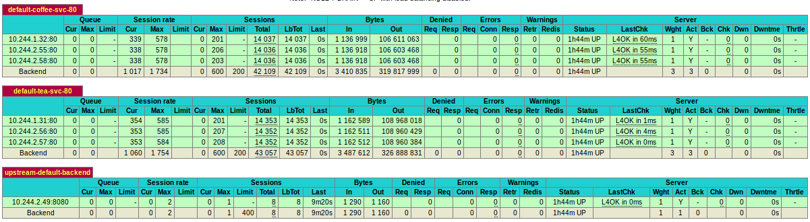

# **HAProxyLoad Balance options for Kubernetes**

## Exposing Services using **NodePort** + external HAProxy Load Balancer

### Configuration:

|   Hostname       | hypothetical IP |   Virtual Machine OS   | RAM | VCPUs |
|:-----------------|:---------------:|:-----------------------|:---:|:-----:|
| k8s-master       | 1.2.3.4         |  Ubuntu 16.04 server   | 8GB | 4     |
| k8s-big-worker   | 4.3.2.1         |  Ubuntu 16.04 server   | 2GB | 2     |
| k8s-small-worker | 4.3.2.2         |  Ubuntu 16.04 server   | 1GB | 1     |
| load-balancer    | 1.1.1.1         |  Ubuntu 16.04 server   | 1GB | 1     |


* The VMs are running on OpenStack Clouds.
* Kubernetes was installed with [kubeadm](https://kubernetes.io/docs/getting-started-guides/kubeadm/) 
* Flannel Pod network (step 2 of installation)  with `--pod-network-cidr 10.244.0.0/16` option
* Workers nodes are joined to master, the **load-balancer host is not joined** to it


### Show nodes
```
$ kubectl get nodes
NAME              STATUS          AGE
k8s-big-worker    Ready           1d
k8s-small-worker  Ready           1d
k8s-master        Ready,master    1d
```

### Create the coffee and tea [deployments](https://kubernetes.io/docs/user-guide/deployments/#what-is-a-deployment)
```
$ kubectl create -f deployments/tea-deploy.yaml
deployment "tea-deploy" created
$ kubectl create -f deployments/coffee-deploy.yaml
deployment "coffee-deploy" created
$ kubectl get deployments
NAME            DESIRED   CURRENT   UP-TO-DATE   AVAILABLE   AGE
coffee-deploy   3         3         3            3           7s
tea-deploy      3         3         3            3           13s
```

### Creating the coffee and tea [services](https://kubernetes.io/docs/user-guide/services/) (expose deployments):
```
$ kubectl create -f services/tea-svc.yaml
service "tea-svc" created
$ kubectl create -f services/coffee-svc.yaml
service "coffee-svc" created
$ kubectl get services
NAME         CLUSTER-IP     EXTERNAL-IP   PORT(S)        AGE
coffee-svc   10.96.67.113   <nodes>       80:31512/TCP   7s
kubernetes   10.96.0.1      <none>        443/TCP        8d
tea-svc      10.107.35.72   <nodes>       80:30984/TCP   13s
```
  
This does the same thing as the `expose` command with `--type=NodePort` option.

e.g `kubectl expose deployment coffee-deploy --port=80 --target-port=80 --type=NodePort`

**NodePort** is the random port (default: 30000-32767) allocated to a service.

In our case we have each node with the coffee service mapped on **31512** port and the tea service on **30984** port. 

### Show nodes which running the coffee service pods
In the file [coffee-deploy.yaml](deployments/coffee-deploy.yaml) (`$ cat coffee-deploy.yaml`) we defined 3 replicas, then we should have 3 pods:

```
$  kubectl get pods | grep -i coffee
coffee-deploy-3697989509-9q0xl   1/1       Running   0          4m
coffee-deploy-3697989509-j8pjq   1/1       Running   0          4m
coffee-deploy-3697989509-ngn4p   1/1       Running   0          4m
```
We can view the nodes  : `$ kubectl describe pod <pod name> | grep -i node`

```
$ kubectl describe pod coffee-deploy-3697989509-9q0xl | grep -i node\
&& kubectl describe pod coffee-deploy-3697989509-j8pjq | grep -i node\
&& kubectl describe pod coffee-deploy-3697989509-ngn4p | grep -i node
Node:       k8s-big-worker/4.3.2.1
Node:       k8s-small-worker/4.3.2.2
Node:       k8s-big-worker/4.3.2.1
```

### Configure HAProxy
In the **load-balancer** host, install HAProxy: `apt-get install haproxy`

It's not objective of this demo teach about HAProxy, but you can find it here:  
* [An Introduction to HAProxy and Load Balancing Concepts ](https://www.digitalocean.com/community/tutorials/an-introduction-to-haproxy-and-load-balancing-concepts) 
* [HAProxy docs](http://www.haproxy.org/download/1.3/doc/haproxy-en.txt)

The file [haproxy.cfg](res/haproxy.cfg) is a commented example of HAProxy configuration file. 

The "k8s-big-worker" have twice memory and processing power than "k8s-small-worker", so the weights are 2 and 1 respectively

Look frontend and backend definitions in the final of file, we should modify our own `/etc/haproxy/haproxy.cfg` changing the Ip of Nodes and the **NodePort**s  finded steps ago (e.g. pods running the tea service on k8s-small-worker 4.3.2.2:**30984**).

After the changes, restart the HAProxy service: 
`$ /etc/init.d/haproxy restart`

Now we can access the statistics page externally: *load-balance ip: port/stats* (e.g. 1.1.1.1:8080/stats or 1.1.1.1:6660/stats), enter the credentials.  

Open a terminal. We can perform requests using  [Apache Bench](https://httpd.apache.org/docs/2.4/programs/ab.html). `$ apt install apache2-utils` 

```
$ ab -c 600 -t 30 http://1.1.1.1:6660/ & ab -c 600 -t 30 http://1.1.1.1:8080/
```

In the HAProxy statistics page we can view the load balancing, like this: 


Clearing the resources:
```
$ kubectl delete deploy coffee-deploy tea-deploy
deployment "coffee-deploy" deleted
deployment "tea-deploy" deleted
$ kubectl delete svc coffee-svc tea-svc
service "coffee-svc" deleted
service "tea-svc" deleted
```
_________
## Using HAProxy  [**Ingress**](https://kubernetes.io/docs/user-guide/ingress/) Controller

## Configuration:

|   Hostname       | hypothetical IP |   Virtual Machine OS   | RAM | VCPUs |
|:-----------------|:---------------:|:-----------------------|:---:|:-----:|
| k8s-master       | 1.2.3.4         |  Ubuntu 16.04 server   | 8GB | 4     |
| k8s-big-worker   | 4.3.2.1         |  Ubuntu 16.04 server   | 2GB | 2     |
| k8s-small-worker | 4.3.2.2         |  Ubuntu 16.04 server   | 1GB | 1     |

* The VMs are running on OpenStack Clouds.
* Kubernetes was installed with [kubeadm](https://kubernetes.io/docs/getting-started-guides/kubeadm/) 
* Flannel Pod network (step 2 of installation)  with `--pod-network-cidr 10.244.0.0/16` option
* All of the following commands were executed from the master node

### Deploy a **default backend** used to serve 404 Not Found pages:

```
$ kubectl run http-default-backend \
   --image=gcr.io/google_containers/defaultbackend:1.0 \
   --port=8080 \
   --limits=cpu=10m,memory=20Mi \
   --expose
service "http-default-backend" created
deployment "http-default-backend" created
```


### Create a TLS [secret](https://kubernetes.io/docs/user-guide/secrets/#overview-of-secrets) named **tls-secret** to be used as default TLS certificate

1. Generate keys

```
$ openssl req \
  -x509 -newkey rsa:2048 -nodes -days 365 \
  -keyout tls.key -out tls.crt -subj '/CN=localhost'
Generating a 2048 bit RSA private key
.................................................................+++
............................................................................................+++
writing new private key to 'tls.key'
-----
```

2. Create secret
```
$ kubectl create secret tls tls-secret --cert=tls.crt --key=tls.key
secret "tls-secret" created
```

3. Remove files
```
$ rm -v tls.crt tls.key
removed 'tls.crt'
removed 'tls.key'
```

### Deploy HAProxy Ingress Controller
In the previous steps, we created the **http-default-backend** service and the **tls-secret** secret, We use them to initialize our [HAProxy Ingress Controller](/ingress/haproxy-ingress-controller.yaml)  
```
$ cat ingress/haproxy-ingress-controller.yaml | grep -i -E 'backend|ssl'
    - --default-backend-service=default/http-default-backend
    - --default-ssl-certificate=default/tls-secret
```

1. Create a haproxy ingress controller deployment
```
$ kubectl create -f ingress/haproxy-ingress-controller.yaml
deployment "haproxy-ingress-controller" created
```

2. Expose our ingress controller as NodePort type

```
$ kubectl expose deploy haproxy-ingress-controller --type=NodePort
service "haproxy-ingress-controller" exposed
```

3.  We can view the ports 31717, 31497 and 32283 allocated to http (80), https(443) and statistics page(1936) services, respectively. Workers nodes need these ports open.

```
kubectl get svc
NAME                         CLUSTER-IP      EXTERNAL-IP   PORT(S)                                     AGE
haproxy-ingress-controller   10.109.208.47   <nodes>       80:31717/TCP,443:31497/TCP,1936:32283/TCP   6m
http-default-backend         10.104.41.44    <none>        8080/TCP                                    11m
kubernetes                   10.96.0.1       <none>        443/TCP                                     6d
```

4. Get the pod  `kubectl get pod | grep -i ingress` and the node `kubectl describe pod <pod name> | grep -i node` that running Ingress Controller. in my case, **k8s-big-worker/4.3.2.1**

```
$ kubectl describe pod haproxy-ingress-controller-3154584451-n3ww3 | grep -i node
Node:		  k8s-big-worker/4.3.2.1
```

We can access the services externally from <IP>:<Port> of service e.g.:

| IP       | Service            | Port     | 
|----------|--------------------|----------|
| 4.3.2.1  | Default backend    | 31717    |
| 4.3.2.1  | Default backend    | 31497    |
| 4.3.2.1  | HAProxy stats page | 32283    |


### Create the Coffee and Tea services.

1. Create the deployments
```
$ kubectl create -f deployments/
deployment "coffee-deploy" created
deployment "tea-deploy" created
```

2. Expose deployments (create **coffee-svc** and **tea-svc** services)
```
$ kubectl expose deploy coffee-deploy --name=coffee-svc --port=80
service "coffee-svc" exposed
$ kubectl expose deploy tea-deploy --name=tea-svc --port=80
service "tea-svc" exposed
```

### Deploy the [Ingress Resource](https://kubernetes.io/docs/user-guide/ingress/#the-ingress-resource)

Create the [drinks ingress](ingress/drinks-ingress.yaml) resource, which we define some rules:
```
$ kubectl create -f ingress/drinks-ingress.yaml 
ingress "drinks-ingress" created
```


Host          | Path       | Service   | 
|-------------|------------|-----------|
|drinks.com.br |   /       | coffee-svc|
|drinks.com.br |  /tea     | tea-svc   |
|drinks.com.in |  /        | tea-svc   |
|drinks.com.in |  /coffee  | coffee-svc|
| -            |  -        | 404       |

We can test these rules with command `curl <ip>:<port> <options>`:
```
$ curl 4.3.2.1:31717
default backend - 404
```
Replace you <ip>:<port> and check the results:
* `$ curl 4.3.2.1:31717 -H 'Host: drinks.com.in' | grep -i -E 'coffee|tea'`
* `$ curl 4.3.2.1:31717 -H 'Host: drinks.com.br' | grep -i -E 'coffee|tea'`
* `$ curl 4.3.2.1:31717/tea -H 'Host: drinks.com.in' | grep -i -E 'coffee|tea'`
* `$ curl 4.3.2.1:31717/coffee -H 'Host: drinks.com.br' | grep -i -E 'coffee|tea'`

### Perform requests and view Load Balance
 We can perform requests using  [Apache Bench](https://httpd.apache.org/docs/2.4/programs/ab.html). `$ apt install apache2-utils` 
```
$ ab -c 600 -t 30 -H "Host: drinks.com.in" 10.11.4.62:31717/ &/
ab -c 600 -t 30 -H "Host: drinks.com.br" 10.11.4.62:31717/
```

In the HAProxy statistics page we can view the load balancing (press F5 to update the page), like this: 



Any question or suggestion: artmr@lsd.ufcg.edu.br


