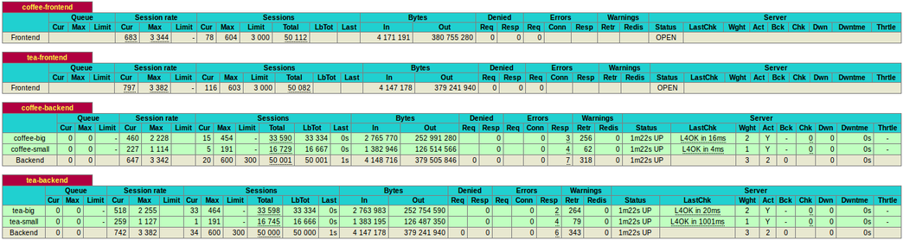

# Exposing Kubernetes Services using **NodePort**

## Configuration:

|   Hostname       | hypothetical IP |   Virtual Machine OS    | RAM | VCPUs |
|:-----------------|:---------------:|:-----------------------|:---:|:-----:|
| k8s-master       | 1.2.3.4         |  Ubuntu 16.04 server   | 8GB | 4     |
| k8s-big-worker   | 4.3.2.1         |  Ubuntu 16.04 server   | 2GB | 2     |
| k8s-small-worker | 4.3.2.2         |  Ubuntu 16.04 server   | 1GB | 1     |
| load-balancer    | 1.1.1.1         |  Ubuntu 16.04 server   | 1GB | 1     |
| client           | -               |  Ubuntu 16.04          | -   | -     |

* The VMs are running on OpenStack Clouds.
* Kubernetes was installed with [kubeadm](https://kubernetes.io/docs/getting-started-guides/kubeadm/) 
* Flannel Pod network (step 2 of installation)  with `--pod-network-cidr 10.244.0.0/16` option
* Workers nodes are joined to master, the **load-balancer host is not joined** to it


### Show nodes
 ```
  $ kubectl get nodes
  NAME              STATUS          AGE
  k8s-big-worker    Ready           1d
  k8s-small-worker  Ready           1d
  k8s-master        Ready,master    1d
  ```

### Create the coffee and tea [deployments](https://kubernetes.io/docs/user-guide/deployments/#what-is-a-deployment)
  ```
  $ kubectl create -f tea-deploy.yaml
  deployment "tea-deploy" created
  $ kubectl create -f coffee-deploy.yaml
  deployment "coffee-deploy" created
  $ kubectl get deployments
  NAME            DESIRED   CURRENT   UP-TO-DATE   AVAILABLE   AGE
  coffee-deploy   3         3         3            3           7s
  tea-deploy      3         3         3            3           13s
  ```

### Creating the coffee and tea [services](https://kubernetes.io/docs/user-guide/services/) (expose deployments):
  ```
  $ kubectl create -f tea-svc.yaml
  service "tea-svc" created
  $ kubectl create -f coffee-svc.yaml
  service "coffee-svc" created
  $ kubectl get services
  NAME         CLUSTER-IP     EXTERNAL-IP   PORT(S)        AGE
  coffee-svc   10.96.67.113   <nodes>       80:31512/TCP   7s
  kubernetes   10.96.0.1      <none>        443/TCP        8d
  tea-svc      10.107.35.72   <nodes>       80:30984/TCP   13s
  ```
  
This does the same thing as the `expose` command with `--type=NodePort` option.

e.g `kubectl expose deployment coffee-deploy --port=80 --target-port=80 --type=NodePort`

**NodePort** is the random port (default: 30000-32767) allocated to a service.

In our case we have each node with the coffee service mapped on **31512** port and the tea service on **30984** port. 

### Show nodes which running the coffee service pods
In the file [coffee-deploy.yaml](coffee-deploy.yaml) (`$ cat coffee-deploy.yaml`) we defined 3 replicas, then we should have 3 pods:
  ```
  $  kubectl get pods | grep -i coffee
  coffee-deploy-3697989509-9q0xl   1/1       Running   0          4m
  coffee-deploy-3697989509-j8pjq   1/1       Running   0          4m
  coffee-deploy-3697989509-ngn4p   1/1       Running   0          4m
  ```

We can view the nodes  : `$ kubectl describe pod <pod name> | grep -i node`

  ```
  $ kubectl describe pod coffee-deploy-3697989509-9q0xl | grep -i node\
  && kubectl describe pod coffee-deploy-3697989509-j8pjq | grep -i node\
  && kubectl describe pod coffee-deploy-3697989509-ngn4p | grep -i node
  Node:		k8s-big-worker/4.3.2.1
  Node:		k8s-small-worker/4.3.2.2
  Node:		k8s-big-worker/4.3.2.1
  ```

### Configure HAProxy
In the **load-balancer** host, install HAProxy: `apt-get install haproxy`

It's not objective of this demo teach about HAProxy, but you can find it here:  
* [An Introduction to HAProxy and Load Balancing Concepts ](https://www.digitalocean.com/community/tutorials/an-introduction-to-haproxy-and-load-balancing-concepts) 
* [HAProxy docs](http://www.haproxy.org/download/1.3/doc/haproxy-en.txt)

The file [haproxy.cfg](haproxy.cfg) is a commented example of HAProxy configuration file. 

The "k8s-big-worker" have twice memory and processing power than "k8s-small-worker", so the weights are 2 and 1 respectively

Look frontend and backend definitions in the final of file, we should modify our own `/etc/haproxy/haproxy.cfg` changing the Ip of Nodes and the **NodePort**s  finded steps ago (e.g. pods running the tea service on k8s-small-worker 4.3.2.2:**30984**).

After the changes, restart the HAProxy service: 
`$ /etc/init.d/haproxy restart`

Now, from a client, we can access the statistics page: *load-balance ip: port/stats* (e.g. 1.1.1.1:8080/stats or 1.1.1.1:6660/stats), enter the credentials.  

Open a terminal. We can perform requests using  [Apache Bench](https://httpd.apache.org/docs/2.4/programs/ab.html). `$ apt install apache2-utils` 

  ```
 $ ab -c 600 -t 30 http://1.1.1.1:6660/ & ab -c 600 -t 30 http://1.1.1.1:8080/
  ```

In the HAProxy statistics page we can view the load balancing, like this: 

 

Any question or suggestion: artmr@lsd.ufcg.edu.br
